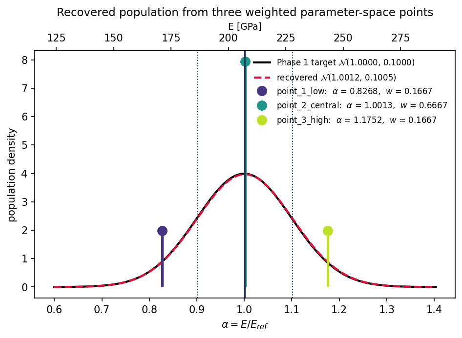
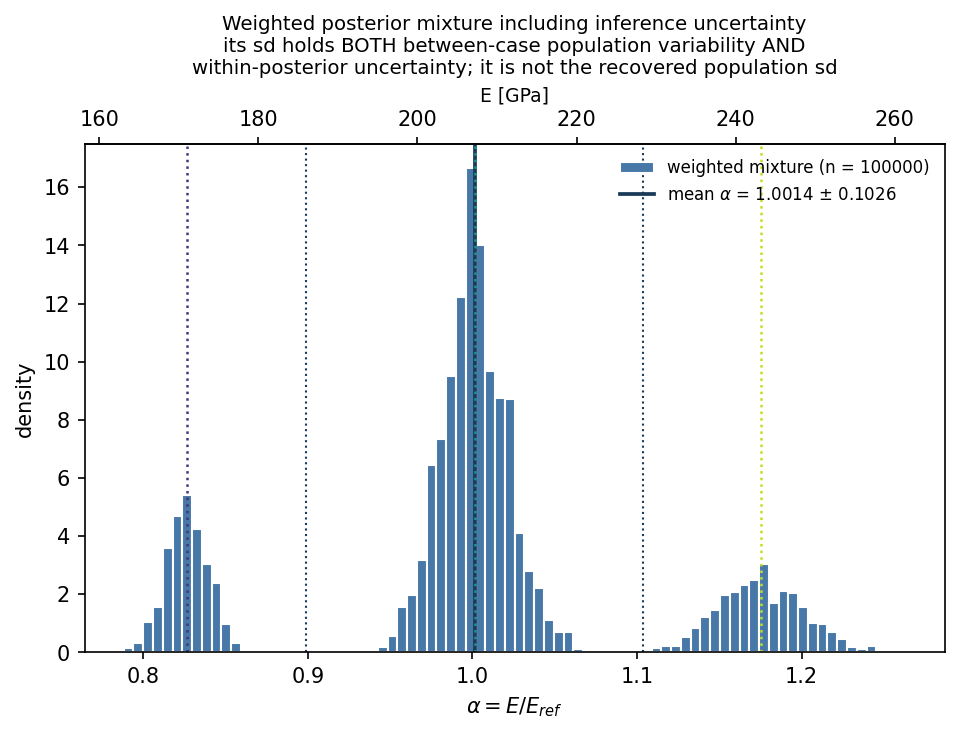

# Weighted Three-Point Phase 2 Bayesian Inference

## Overview

This implementation tests a computationally efficient way to propagate a known Phase 1 distribution through the existing Kratos Bayesian inverse-analysis pipeline.

Instead of performing one Phase 2 Bayesian inversion for every Phase 1 realization, the Phase 1 distribution of Young's modulus is represented by three weighted Gauss-Hermite points. Each point is propagated through the actual Kratos forward model, inverted independently in Phase 2, and then combined using its quadrature weight.

The method reduced the Phase 2 calculation from approximately 9.98 million Kratos forward solves for 998 independent inversions to 30,000 forward solves for three inversions.

The current implementation is a validation study for a one-dimensional uncertain parameter. It preserves the general Kratos forward-model architecture and does not use a beam-specific analytical shortcut.

## Phase 1 parameter distribution

The uncertain parameter is the Young's-modulus multiplier

$$
\alpha=\frac{E}{E_{\mathrm{ref}}},
$$

where

$$
E_{\mathrm{ref}}=206.9\ \text{GPa}.
$$

The prescribed Phase 1 distribution is

$$
\alpha\sim\mathcal N(1.0,0.1^2).
$$

Therefore,

$$
E\sim\mathcal N(206.9,20.69^2)\ \text{GPa}.
$$

## Why the first displacement-space method was rejected

The first attempt created three symmetric points directly from the mean and standard deviation of displacement:

$$
u_j=\mu_u+z_j\sigma_u.
$$

This produced a recovered result of approximately

$$
\alpha=1.0320\pm0.1818,
$$

which substantially overestimated the target standard deviation of 0.1.

The problem is that the transformation between Young's modulus and displacement is nonlinear. Consequently, symmetric points in displacement space do not generally transform into symmetric points in parameter space. The corrected method therefore selects the representative points in the original uncertain-parameter space before evaluating the forward model.

## Three-point Gauss-Hermite representation

The representative parameters are calculated using

$$
\alpha_j=\mu_\alpha+z_j\sigma_\alpha,
$$

with

$$
z=\left[-\sqrt{3},0,+\sqrt{3}\right]
$$

and weights

$$
w=\left[\frac{1}{6},\frac{2}{3},\frac{1}{6}\right].
$$

For $\mu_\alpha=1.0$ and $\sigma_\alpha=0.1$, the points are:

| Case | $z_j$ | Weight $w_j$ | True $\alpha_j$ | True $E_j$ [GPa] |
|---|---:|---:|---:|---:|
| Low | $-\sqrt{3}$ | 0.1667 | 0.826795 | 171.064 |
| Central | 0 | 0.6667 | 1.000000 | 206.900 |
| High | $+\sqrt{3}$ | 0.1667 | 1.173205 | 242.736 |

These weighted points reproduce the prescribed parameter mean and variance:

$$
\sum_{j=1}^{3}w_j\alpha_j=1.0,
$$

$$
\sum_{j=1}^{3}w_j(\alpha_j-1.0)^2=0.1^2.
$$

## Complete workflow

### 1. Generate three Phase 1 responses

Each representative parameter is converted to Young's modulus:

$$
E_j=\alpha_jE_{\mathrm{ref}}.
$$

The actual Phase 1 Kratos model is then evaluated independently:

$$
E_j\longrightarrow\mathcal G(E_j)\longrightarrow u_j.
$$

The generated sensor displacements were:

| Case | True $\alpha$ | True displacement $u$ [m] |
|---|---:|---:|
| Low | 0.826795 | $-2.290832\times10^{-6}$ |
| Central | 1.000000 | $-1.894048\times10^{-6}$ |
| High | 1.173205 | $-1.614422\times10^{-6}$ |

A fresh Kratos model and analysis object are created for every forward evaluation. No expression such as `u_ref / alpha` is used.

### 2. Use zero-mean representative measurement noise

For the initial validation, the expected value of the zero-mean measurement noise is used:

$$
\hat u_j=u_j.
$$

Only three representative observations are available, so adding one random noise realization to each point could shift the recovered mean and standard deviation. Using the zero-noise expectation isolates the accuracy of the three-point population approximation.

Phase 2 still uses the specified Gaussian measurement-noise standard deviation:

$$
\sigma_{\mathrm{noise}}=3.788097\times10^{-8}\ \text{m}.
$$

This means that measurement uncertainty remains represented inside each individual posterior.

### 3. Run three independent Phase 2 inversions

The three displacements represent three different latent Young's-modulus values. They are therefore processed as independent inverse problems:

$$
\hat u_1\longrightarrow p_1(\alpha\mid\hat u_1),
$$

$$
\hat u_2\longrightarrow p_2(\alpha\mid\hat u_2),
$$

$$
\hat u_3\longrightarrow p_3(\alpha\mid\hat u_3).
$$

They must not be placed in one measurement file and fitted with one common $\alpha$. Each inversion uses:

- the existing Kratos forward model;
- the existing Gaussian likelihood;
- the existing broad Phase 2 prior;
- the existing SMC sampler;
- a fresh `Kratos.Model()`;
- a unique output directory and reproducible seed.

Each SMC inversion required 10,000 forward solves, giving 30,000 forward solves in total.

## Individual Phase 2 results

| Case | True $\alpha$ | Posterior mean | Posterior SD | Weight |
|---|---:|---:|---:|---:|
| Low | 0.826795 | 0.826846 | 0.012966 | 0.1667 |
| Central | 1.000000 | 1.001343 | 0.020056 | 0.6667 |
| High | 1.173205 | 1.175155 | 0.026160 | 0.1667 |

All three posterior means are close to their corresponding true values. The posterior SD increases for the stiffer cases because the displacement magnitude becomes smaller while the absolute measurement-noise standard deviation remains fixed.

## Recovering the population distribution

### Primary population mean

Let $m_j$ be the posterior mean from Phase 2 case $j$. The recovered population mean is

$$
\mu_{\alpha,\mathrm{rec}}=\sum_{j=1}^{3}w_jm_j.
$$

### Primary population standard deviation

The recovered population variance is calculated from variation between the three posterior means:

$$
\sigma_{\alpha,\mathrm{between}}^2
=\sum_{j=1}^{3}w_j(m_j-\mu_{\alpha,\mathrm{rec}})^2.
$$

This is the primary estimate of the Phase 1 population variability.

The same statistics are converted to Young's modulus using

$$
E=\alpha E_{\mathrm{ref}}.
$$

## Recovered results

| Quantity | Phase 1 target | Recovered | Relative error |
|---|---:|---:|---:|
| Mean $\alpha$ | 1.000000 | 1.001229 | 0.123% |
| Population SD $\alpha$ | 0.100000 | 0.100548 | 0.548% |
| Mean $E$ | 206.900 GPa | 207.154 GPa | 0.123% |
| Population SD $E$ | 20.690 GPa | 20.803 GPa | 0.548% |

The target and recovered moment-matched normal curves almost completely overlap. This confirms that the corrected three-point parameter-space method accurately reproduces the prescribed mean and standard deviation for this validation problem.



## Weighted posterior mixture

The complete posterior distributions can also be combined as the weighted mixture

$$
p_{\mathrm{mix}}(\alpha)
=\frac{1}{6}p_1(\alpha)
+\frac{2}{3}p_2(\alpha)
+\frac{1}{6}p_3(\alpha).
$$

The implementation generated 100,000 inexpensive resamples from the stored posteriors. The realized allocation was:

| Case | Resampled values |
|---|---:|
| Low | 16,548 |
| Central | 66,849 |
| High | 16,603 |

These are posterior resamples and do not require additional Kratos solves.

The mixture result was approximately

$$
\alpha=1.0014\pm0.1026.
$$

The three visible peaks are expected because the approximation contains three discrete representative cases. The central peak is largest because its weight is $2/3$.



## Population SD versus mixture SD

The population SD and total mixture SD have different meanings.

If $s_j$ is the SD within posterior $j$, the total mixture variance is

$$
\sigma_{\mathrm{mix}}^2
=\sum_{j=1}^{3}w_j
\left[s_j^2+(m_j-\mu_{\alpha,\mathrm{rec}})^2\right].
$$

It contains:

1. between-case population variability; and
2. within-posterior inference uncertainty.

The results are:

| Measure | $\alpha$ | $E$ [GPa] | Interpretation |
|---|---:|---:|---|
| Between-case SD | 0.100548 | 20.803 | Recovered population variability |
| Total mixture SD | 0.102568 | 21.221 | Population variability plus inference uncertainty |

The between-case SD is therefore the appropriate value to compare with the Phase 1 population SD. The total mixture SD must not be reported as though it represents population variability alone.

## Configuration

The three-point mode can be configured in `BayesianParameters.json`:

```json
"three_point_inference": {
    "enabled": true,
    "support_space": "alpha",
    "alpha_mean": 1.0,
    "alpha_std": 0.1,
    "E_ref": 206900000000.0,
    "measurement_noise_sigma": 3.788097e-08,
    "measurement_generation": "zero_mean_noise",
    "input_path": "three_point_inputs",
    "output_path": "output_three_point",
    "combined_sample_count": 100000,
    "base_random_seed": 20260802,
    "resume": false
}
```

Only one controller mode should be enabled at a time. Enabling both the ordinary batch controller and the three-point controller should raise a configuration error.

## Expected directory structure

```text
bayesian_inference/
├── MainBayesian.py
├── bayesian_analysis.py
├── three_point_bayesian_analysis.py
├── kratos_forward_model.py
├── likelihood.py
├── BayesianParameters.json
├── three_point_inputs/
│   ├── point_1_low/
│   │   ├── measured_data.csv
│   │   └── metadata.json
│   ├── point_2_central/
│   │   ├── measured_data.csv
│   │   └── metadata.json
│   └── point_3_high/
│       ├── measured_data.csv
│       └── metadata.json
└── output_three_point/
    ├── point_1_low/
    ├── point_2_central/
    ├── point_3_high/
    └── combined/
        ├── combined_posterior_samples.npz
        ├── combined_summary.json
        ├── case_summary.csv
        ├── plotA_recovered_population.png
        └── plotB_posterior_mixture.png
```

## Running the analysis

Set

```json
"three_point_inference": {
    "enabled": true
}
```

and run:

```bash
python MainBayesian.py
```

The controller should generate the three measurement cases, execute the three independent Bayesian inversions, and create the combined results.

## Computational comparison

| Method | Phase 2 inversions | Approximate Kratos solves |
|---|---:|---:|
| Full 998-case batch | 998 | 9,980,000 |
| Weighted three-point method | 3 | 30,000 |

The three-point implementation reduces the number of Phase 2 Kratos solves by approximately 99.7% for this test.

## Interpretation and scope

This experiment demonstrates that:

- Phase 2 can accurately recover each prescribed parameter-space point;
- three weighted posterior means can reproduce the prescribed Phase 1 mean and SD;
- the Kratos forward model and SMC sampler can remain unchanged;
- population variability can be separated from within-posterior uncertainty;
- a three-point approximation can provide a useful low-cost validation test.

However, this experiment does not independently infer an unknown population distribution solely from the collapsed mean and SD of displacement. The three parameter-space points were constructed using the already-known Phase 1 values $\mu_\alpha=1.0$ and $\sigma_\alpha=0.1$.

This method is therefore appropriate for synthetic full-circle validation and reduced-order propagation when the input distribution is known. If the population mean and SD are unknown and must be inferred directly from many observations, a population or hierarchical Bayesian likelihood is required.

For more accurate distribution-shape reconstruction, the same architecture can be extended to five, seven, or nine quadrature points. For multiple uncertain parameters, an appropriate multidimensional quadrature, sparse-grid, sigma-point, or surrogate-model strategy will be required.
